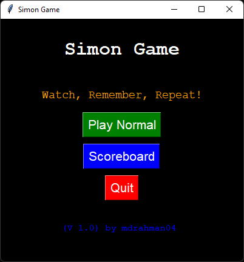
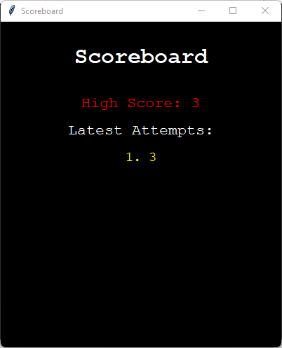
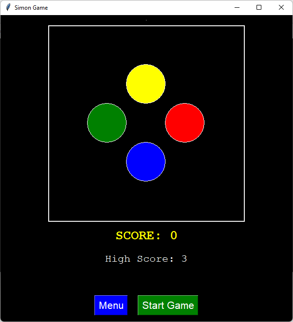
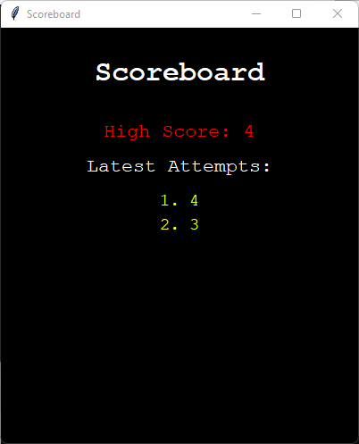

# Simon Game

**Simon Game** is a classic memory game where players watch a sequence of colored buttons light up, remember the sequence, and then repeat it. This project is implemented using Python and the tkinter library for the graphical user interface.

## Table of Contents

- [Features](#features)
- [How to Play](#how-to-play)
- [Installation](#installation)
- [Usage](#usage)
- [Scoreboard](#scoreboard)
- [License](#license)

## Features

- Classic Simon Game experience.
- Colorful buttons that light up in a sequence.
- Challenging gameplay that tests the memory.
- Keeps track of high score.
- A scoreboard to view last 10 attempts.

## How to Play

1. Click the "Start Game" button to begin.
2. Watch the pattern of colored buttons as they light up.
3. Remember the sequence.
4. Repeat the sequence by clicking the buttons in the same order.
5. If you succeed, your score increases, and the game gets more challenging.
6. If you make a mistake, the game ends.
7. Then press "Start Game" again to restart the game.

## Installation

1. Clone this repository: git clone https://github.com/mdrahman04/simon_game.git

2. Navigate to the installation directory.

3. Run the game.

The above process will work within Python evvironment.

## Usage

- Follow the on-screen instructions to play the game.
- Click the "Menu" button to return to the main menu.
- Click the "Scoreboard" button to view your latest attempts.

## Scoreboard

The game keeps track of your latest attempts, and you can view them in the "Scoreboard" section on the main menu.

## License

This project is licensed under the MIT License - see the [LICENSE](LICENSE) file for details.

---

© 2023 [Mohammed Mahir Rahman](https://github.com/mdrahman04)